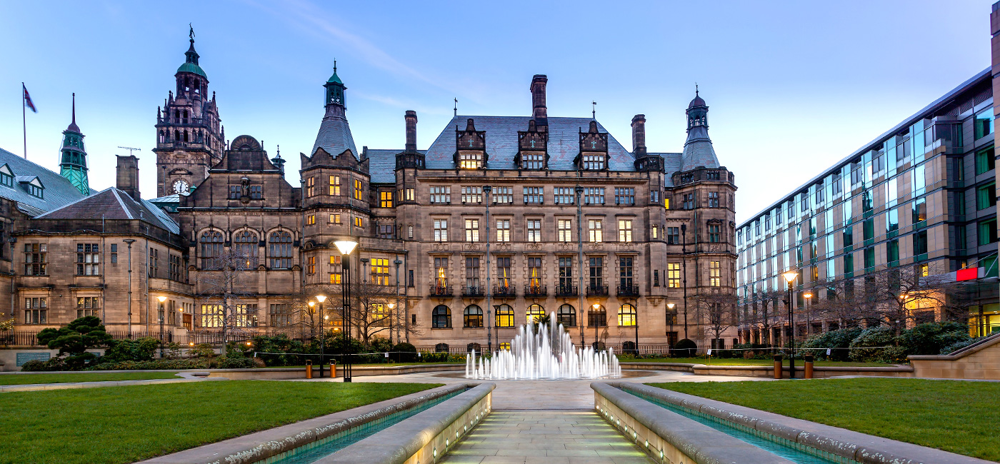
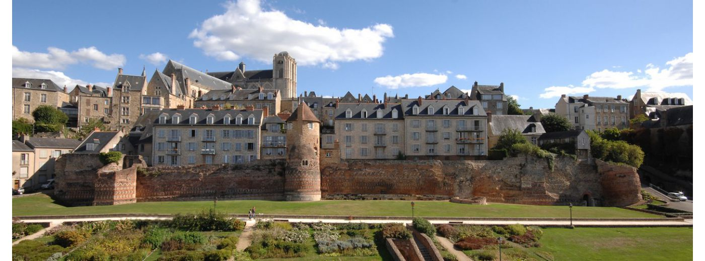

Loïc Barrault (M) is a Senior Lecturer in the Natural Language Processing group at the University of Sheffield. He obtained his PhD at the University of Avignon in 2008 in the field of automatic speech recognition. Then he did 2 years as researcher in  University of Le Mans to work on statistical and neural machine translation. Loïc Barrault participated in many international projects, namely EuroMatrix+, MateCAT, DARPA BOLT, and national projects, namely ANR Cosmat, “Projet d’Investissement d’Avenir” PACTE and a large industrial project PEA TRAD. He’s currently coordinating the EU ChistERA M2CR project and actively involved in the ChistERA ALLIES project. His research work focuses on statistical and neural machine translation, by including linguistics aspects (factored neural machine translation) and by considering multiple modalities (multimodal neural machine translation). He is one of the organisers of the Multimodal Machine Translation shared task at WMT.

 

 Photo: Cité Plantagenêt, Le Mans Tourisme 
 

[//]: # ( <!--  
 Photo: Cité Plantagenêt, Le Mans Tourisme 
 --> ) 

