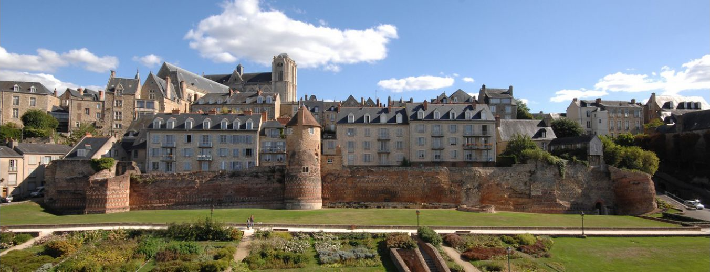
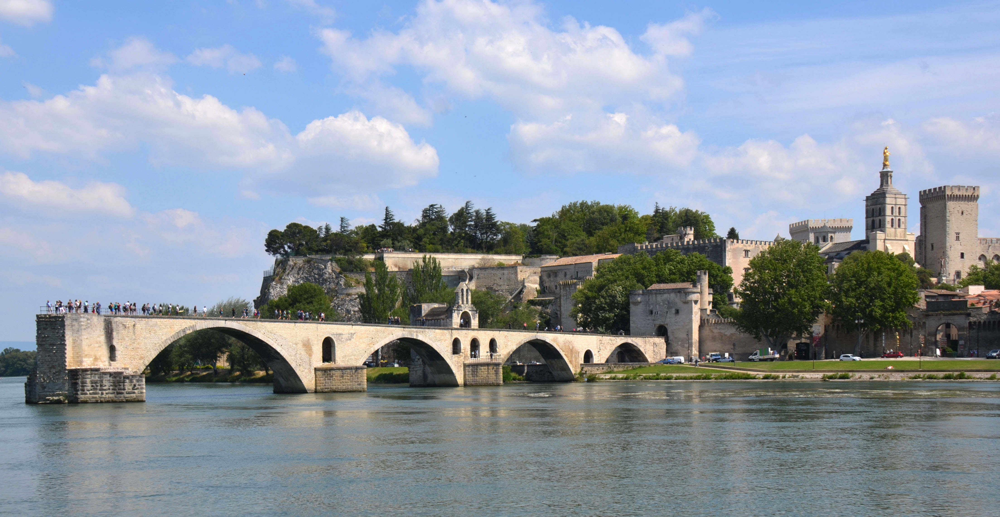

Loïc Barrault (M) is a Senior Lecturer in the Natural Language Processing group at the University of Sheffield. 
He obtained his PhD at the University of Avignon in 2008 in the field of automatic speech recognition. 
Then he did 2 years as researcher and 9 years as Associate Professor at LIUM, Le Mans Université working on statistical and neural machine translation. 
Loïc Barrault participated in many international projects, namely EuroMatrix+, MateCAT, DARPA BOLT, and national projects, namely ANR Cosmat, “Projet d’Investissement d’Avenir” PACTE and a large industrial project PEA TRAD. 
He coordinated the EU ChistERA M2CR project and is currently actively involved in the ChistERA ALLIES project. 
His research work focuses on statistical and neural machine translation, by including linguistics aspects (factored neural machine translation), by considering multiple modalities (multimodal neural machine translation) and by designing lifelong learning methods for MT. 
He is one of the organisers of the Multimodal Machine Translation shared task at WMT.

 
 
Photo: Cité Plantagenêt, Le Mans Tourisme 

 
 

 
 
Photo: By Henk Monster, <a href="https://creativecommons.org/licenses/by/3.0" title="Creative Commons Attribution 3.0">CC BY 3.0</a>, <a href="https://commons.wikimedia.org/w/index.php?curid=57881800">Link</a>

